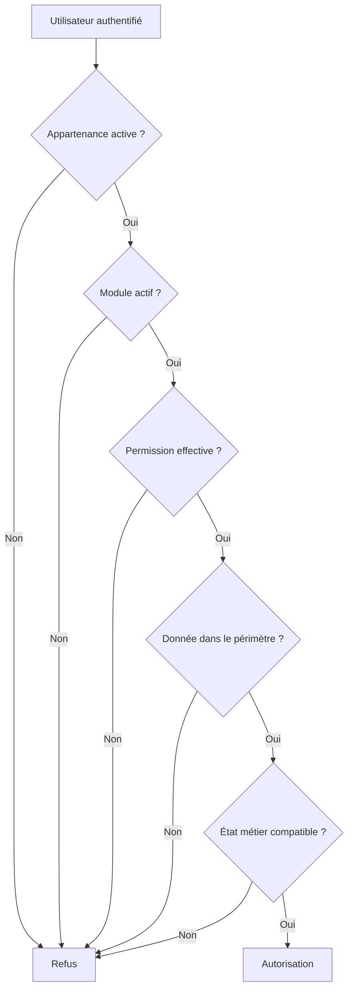

# GeEcole — Système d’autorisation

## Statut

- **Statut :** officiel
- **Décision validée :** 21 juillet 2026
- **Périmètre :** profils d’accès, permissions, périmètres de données, délégation, RLS, RPC et audit
- **Application :** GeEcole
- **Contexte :** établissements scolaires de la République de Guinée

Ce document est la référence transversale du système d’autorisation de GeEcole. Les documents de permissions propres à chaque module le complètent sans pouvoir affaiblir ses invariants de sécurité.

## 1. Objectifs

Le système doit permettre de répondre à quatre questions :

1. Qui est connecté ?
2. À quel établissement appartient cette personne ?
3. Que peut-elle faire ?
4. Sur quelles données et dans quel état métier peut-elle le faire ?

Le modèle retenu est :

```text
Appartenance active
+ profil(s) d’accès
+ permission
+ périmètre
+ module actif
+ règle métier
= autorisation
```

Le découpage en modules organise le catalogue de permissions. Il ne remplace pas le contrôle du périmètre des données.

## 2. Principes obligatoires

1. L’isolation entre établissements est absolue.
2. Un utilisateur possède une seule appartenance par établissement, mais peut cumuler plusieurs profils d’accès dans cette appartenance.
3. Les permissions effectives sont l’union des permissions de ses profils actifs et non expirés.
4. Un périmètre appartient à l’affectation d’un profil, jamais globalement à l’utilisateur.
5. Les relations métier constituent en priorité la source des périmètres.
6. Les permissions individuelles directes sont exclues de la V1.
7. La V1 ne gère que des autorisations explicites : aucun mécanisme générique `deny`.
8. Les profils standards GeEcole sont séparés des profils locaux d’un établissement.
9. Les profils standards ne sont pas modifiables. Un établissement les personnalise par duplication.
10. Les autorisations détaillées restent en base et ne sont pas intégralement copiées dans le JWT.
11. React adapte l’interface, mais ne constitue jamais une barrière de sécurité.
12. Les RLS protègent les lignes et les RPC sécurisent les opérations métier sensibles.
13. Un module désactivé reste inaccessible par appel direct.
14. Une permission ne permet jamais de contourner implicitement une règle métier.
15. Toute modification sensible des accès est auditée.

## 3. Vocabulaire

### 3.1 Utilisateur

Identité authentifiée par Supabase Auth et identifiée par `auth.uid()`.

Supabase Auth répond uniquement à la question « qui est connecté ? ». Les métadonnées modifiables par le client ne sont pas une source d’autorisation.

### 3.2 Appartenance

Relation unique entre un utilisateur et un établissement. Elle porte notamment :

- l’établissement ;
- l’utilisateur ;
- le statut `active` ou `suspended` ;
- la qualité de propriétaire ;
- les dates d’accès ;
- les informations d’audit.

### 3.3 Profil d’accès

Ensemble cohérent de permissions correspondant à une responsabilité exercée dans GeEcole, par exemple `Enseignant`, `Secrétariat` ou `Encaissement`.

Une fonction contractuelle du module Personnel n’est pas un profil d’accès. Par exemple, « professeur de mathématiques » décrit un emploi ; `Enseignant` décrit les accès applicatifs.

### 3.4 Permission

Action fonctionnelle autorisable, codée sous la forme :

```text
module.ressource.action
```

Les actions métier sont préférées à un CRUD générique :

```text
schooling.students.read
schooling.enrollments.create
schooling.enrollments.validate
notes.assessments.create
notes.results.enter
notes.results.correct
notes.results.correct_after_lock
bulletins.generate
bulletins.validate
bulletins.publish
finance.payments.collect
finance.payments.cancel
finance.pricing.manage
personnel.contracts.manage
settings.access.manage
```

La validation et la publication d’un bulletin sont toujours deux permissions distinctes.

### 3.5 Périmètre

Ensemble de données sur lequel une permission peut être exercée. Exemples : cours affectés, classe principale, cycle supervisé, enfants liés ou propre dossier.

### 3.6 Règle métier

Condition liée à l’état d’un objet ou d’un processus : année clôturée, période verrouillée, bulletin publié, paiement annulé ou fonctionnalité désactivée.

## 4. Décision d’autorisation

Une opération est autorisée uniquement si tous les contrôles suivants réussissent :



L’interface peut masquer une action avant l’appel. La base répète toujours les contrôles nécessaires.

## 5. Profils standards

### 5.1 Profils internes

| Profil | Responsabilité principale |
|---|---|
| Propriétaire | Pouvoir intégral dans son établissement |
| Administration | Paramétrage fonctionnel et gestion déléguée des accès |
| Direction | Supervision globale, validations et décisions sensibles |
| Responsable pédagogique | Pilotage des cours, périodes, notes et bulletins |
| Enseignant | Gestion de ses cours, évaluations, résultats et appréciations |
| Enseignant principal | Synthèse et suivi de sa classe principale |
| Secrétariat | Élèves, responsables, inscriptions et documents |
| Encaissement | Encaissements et reçus |
| Gestion financière | Tarifs, échéanciers, avantages, contrôle et rapports financiers |
| Gestion du personnel | Employés, contrats, absences et opérations RH autorisées |

### 5.2 Profils personnels

| Profil | Responsabilité principale |
|---|---|
| Parent / Responsable | Consultation des élèves auxquels il est lié |
| Élève | Consultation de son propre dossier |

### 5.3 Séparations obligatoires

- `Encaissement` n’accorde pas la gestion des tarifs, des échéanciers ou des avantages.
- L’annulation d’un paiement est distincte de son encaissement.
- `Gestion financière` ne donne pas automatiquement la gestion des accès.
- `Direction` ne donne pas automatiquement la gestion des profils d’accès.
- `Administration` ne donne pas automatiquement les validations métier sensibles.
- `Enseignant principal` complète `Enseignant` sans étendre les droits de ce dernier à toute la classe pour toutes les ressources.

## 6. Propriétaire de l’établissement

Le Propriétaire possède automatiquement toutes les permissions présentes et futures, sur tous les modules, toutes les années et tous les périmètres de son établissement.

La propriété est un invariant de l’appartenance (`memberships.is_owner`) et non un profil configurable dépendant d’une liste de permissions.

### 6.1 Pouvoirs

Le Propriétaire peut notamment :

- administrer tous les modules et paramètres ;
- gérer les utilisateurs, profils et délégations ;
- consulter l’audit ;
- exécuter les actions exceptionnelles prévues par le métier ;
- promouvoir un autre propriétaire ;
- transférer ou partager la propriété.

### 6.2 Limites

Le Propriétaire ne peut pas :

- accéder à un autre établissement ;
- contourner l’isolation RLS ;
- modifier ou supprimer les événements d’audit protégés ;
- falsifier l’auteur d’une opération ;
- utiliser les capacités réservées à la plateforme ou au `service_role` ;
- contourner silencieusement une règle métier.

Une correction, réouverture, annulation ou suppression exceptionnelle doit passer par une action métier explicite et auditée.

### 6.3 Invariants

- Un établissement conserve au moins un propriétaire actif.
- Le dernier propriétaire ne peut être ni suspendu, ni supprimé, ni rétrogradé.
- Seul un propriétaire peut promouvoir ou révoquer un autre propriétaire.
- Un administrateur ne peut jamais s’auto-promouvoir propriétaire.
- Toute promotion, révocation ou transmission est auditée.
- Les opérations de propriété exigent une réauthentification récente.
- L’ajout d’un propriétaire affiche un avertissement explicite sur l’étendue des pouvoirs accordés.

## 7. Profils standards et profils locaux

Deux niveaux sont séparés :

```text
access_profile_templates
└── modèles standards maintenus par GeEcole

access_profiles
└── profils utilisables dans un établissement
```

Un profil local peut référencer un modèle avec `source_template_id` et la version de ce modèle utilisée lors de sa création.

Règles :

- un modèle standard est immuable pour l’établissement ;
- un profil personnalisé est créé par duplication ;
- une évolution d’un modèle ne modifie jamais silencieusement un profil personnalisé ;
- l’interface peut proposer une comparaison ou une mise à niveau explicite ;
- toute modification d’un profil local est auditée.

## 8. Cumul des profils et périmètres

Les permissions effectives sont calculées par union des profils actifs. Le périmètre reste attaché à chaque affectation de profil.

Exemple :

```text
Profil Enseignant
└── périmètre : cours affectés

Profil Responsable pédagogique
└── périmètre : cycle Lycée
```

Le périmètre `Lycée` du second profil ne doit jamais étendre `notes.results.enter` obtenu par le profil Enseignant si cette permission n’existe pas dans le profil Responsable pédagogique.

Les cumuls sensibles déclenchent un avertissement et un audit renforcé, notamment :

- encaissement et annulation d’encaissement ;
- préparation et validation d’une opération ;
- gestion des profils et attribution de permissions sensibles ;
- préparation et validation de la paie.

La V1 ne met pas en place un moteur général de séparation des tâches. Les interdictions obligatoires sont portées par les règles métier ou les RPC concernées.

## 9. Périmètres

### 9.1 Sources métier prioritaires

| Profil ou usage | Source du périmètre |
|---|---|
| Enseignant | Affectations pédagogiques actives |
| Enseignant principal | Affectations de classe principale |
| Parent / Responsable | Relations responsables–élèves |
| Élève | Lien entre le compte et l’élève |
| Responsable pédagogique | Affectations de supervision |
| Personnel | Soi-même ou équipe explicitement gérée |

Une table générique de périmètres ne remplace jamais ces relations.

### 9.2 Périmètres explicites

Les délégations et périmètres exceptionnels utilisent des références explicites :

```text
access_scope_assignments
├── id
├── membership_profile_id
├── academic_year_id
├── cycle_id
├── level_id
├── class_id
├── valid_from
├── valid_until
├── created_by
└── created_at
```

Contraintes obligatoires :

- une seule cible parmi `cycle_id`, `level_id` et `class_id` ;
- chaque cible appartient au même établissement ;
- l’année est compatible avec la cible ;
- les dates forment un intervalle valide ;
- aucun couple polymorphe `scope_type/scope_id` sans intégrité référentielle.

Pour la V1, `Secrétariat` et `Encaissement` portent normalement sur tout l’établissement. Une granularité par caisse ou guichet ne sera ajoutée qu’avec un besoin métier documenté.

## 10. Catalogue et délégation des permissions

Le catalogue des permissions est maintenu par GeEcole. Chaque permission possède au minimum :

```text
permissions
├── id
├── code
├── module
├── resource
├── action
├── label
├── description
├── sensitivity
├── is_assignable
├── requires_delegation
└── created_at
```

L’existence d’une ligne dans `access_profile_permissions` signifie `allow`. Aucune colonne `effect` n’est utilisée en V1.

Une personne ne peut attribuer que les profils et permissions qu’elle est autorisée à déléguer. La permission de gérer les profils ne donne pas, à elle seule, le droit de composer un profil plus puissant que son propre pouvoir de délégation.

Les permissions sont classées au minimum en :

- attribuable ;
- sensible ;
- système non attribuable ;
- attribuable uniquement avec délégation explicite.

Le serveur valide cette règle lors de la création d’un profil, de sa modification et de son affectation.

## 11. Modèle de données conceptuel

```text
profiles
└── identité applicative

memberships
└── appartenance unique utilisateur–établissement et propriété

access_profile_templates
└── modèles standards GeEcole versionnés

access_profiles
└── profils locaux d’un établissement

permissions
└── catalogue global des actions

access_profile_permissions
└── permissions autorisées par profil

membership_access_profiles
└── profils affectés à une appartenance

access_scope_assignments
└── périmètres exceptionnels attachés à une affectation

access_audit_events
└── journal immuable des changements d’accès
```

### 11.1 Contraintes principales

- `memberships` conserve `unique(institution_id, user_id)`.
- Une affectation de profil référence un profil du même établissement.
- Une affectation inactive, future ou expirée n’accorde aucun droit.
- Un profil inactif n’accorde aucun droit.
- Un profil local ne peut référencer que des permissions attribuables.
- Toutes les tables locales portent ou permettent de résoudre sans ambiguïté `institution_id`.

La définition SQL détaillée sera livrée dans une migration dédiée après validation des requêtes RLS et RPC. Le présent document fixe les invariants, pas les noms définitifs de toutes les contraintes SQL.

## 12. Fonctions de sécurité

Les contrôles partagés peuvent être regroupés dans un schéma non exposé à l’API, par exemple `security` :

```text
security.is_active_member(...)
security.is_owner(...)
security.has_permission(...)
security.is_module_enabled(...)
security.can_manage_course(...)
security.can_read_linked_student(...)
security.can_read_own_student_record(...)
security.can_manage_employee(...)
security.is_academic_period_open(...)
```

`has_permission` vérifie l’appartenance, la propriété, les profils, leurs permissions et leurs périodes de validité. Le contrôle du périmètre et celui de l’état métier restent explicites dans les fonctions spécialisées ou les RPC.

### 12.1 Exigences `SECURITY DEFINER`

Toute fonction `SECURITY DEFINER` doit respecter les règles suivantes :

- `search_path` vide ou strict et maîtrisé ;
- qualification complète des objets (`public.table_name`) ;
- retrait de `EXECUTE` à `PUBLIC` ;
- attribution explicite aux seuls rôles requis ;
- propriétaire de fonction maîtrisé ;
- utilisateur courant obtenu avec `auth.uid()` ;
- aucun `user_id` fourni par le client utilisé comme identité de l’acteur ;
- aucune récursion involontaire entre fonction de sécurité et politique RLS ;
- paramètres validés dans le même établissement ;
- tests positifs, négatifs et inter-établissements.

## 13. RLS et RPC

### 13.1 RLS

Une politique RLS ne doit pas accorder l’accès sur la seule base de `is_active_member()` lorsqu’un périmètre métier est requis.

Chaque politique doit combiner les contrôles pertinents :

- appartenance et établissement ;
- année scolaire ;
- permission ;
- périmètre ;
- état actif des relations utilisées.

Le rôle `service_role` reste réservé aux traitements techniques contrôlés et ne doit jamais être exposé au frontend.

### 13.2 RPC

Une RPC est requise pour une opération transactionnelle, sensible ou soumise à plusieurs invariants, notamment :

- validation ou publication d’un bulletin ;
- correction après verrouillage ;
- encaissement ou annulation ;
- transfert de propriété ;
- modification d’un profil sensible ;
- promotion, suspension ou révocation d’un accès ;
- opération exceptionnelle sur une période ou une année clôturée.

La RPC répète les contrôles de permission, périmètre, module et état métier, puis écrit l’audit dans la même transaction lorsque cela est nécessaire.

## 14. Audit

`access_audit_events` est un journal fonctionnel immuable.

Il conserve au minimum :

- établissement ;
- acteur déterminé côté serveur ;
- action ;
- cible ;
- valeurs avant et après ;
- motif lorsque requis ;
- date serveur ;
- identifiant de corrélation si disponible.

Règles :

- aucune insertion directe depuis le frontend ;
- écriture uniquement par RPC sécurisée ou trigger ;
- aucune mise à jour ;
- aucune suppression fonctionnelle ;
- lecture limitée aux permissions prévues ;
- l’Owner peut consulter, mais pas altérer le journal.

Événements minimums : affectation ou retrait d’un profil, suspension ou réactivation, délégation, modification de profil, attribution sensible, promotion ou révocation d’un propriétaire.

## 15. JWT et frontend

Le JWT transporte l’identité et les informations techniques minimales de session. Il ne contient pas la liste complète des cours, classes, élèves, permissions ou délégations.

Le frontend peut charger un résumé d’autorisations pour :

- filtrer les menus ;
- protéger les routes pour l’expérience utilisateur ;
- masquer ou désactiver les actions ;
- afficher les périmètres compréhensibles.

Une URL ou un appel API direct reste sécurisé par la base.

Dans l’interface, les termes métiers sont privilégiés : `Profils d’accès`, `Personnes et accès`, `Périmètre`. Les rôles PostgreSQL et les détails RLS ne sont pas exposés.

## 16. Performances et index

Les index sont définis à partir des requêtes finales et validés avec `EXPLAIN (ANALYZE, BUFFERS)` sur des volumes représentatifs.

Les chemins d’accès attendus couvrent notamment :

```text
memberships(user_id, institution_id, status)
membership_access_profiles(membership_id, access_profile_id, valid_from, valid_until)
access_profile_permissions(access_profile_id, permission_id)
permissions(code)
teaching_assignments(institution_id, academic_year_id, teacher_id, course_id, status)
student_guardians(guardian_id, student_id)
```

Cette liste n’est pas une prescription d’index définitifs : l’ordre des colonnes et les index partiels dépendent des requêtes réellement implémentées.

## 17. Migration depuis le modèle actuel

Le modèle actuel repose sur `memberships.role` avec les valeurs `owner`, `admin`, `secretary`, `teacher` et `finance`. La migration est additive et module par module.

### 17.1 Étapes

1. Ajouter les nouvelles tables et fonctions sans supprimer l’ancien modèle.
2. Créer et versionner les modèles de profils standards.
3. Créer les profils locaux nécessaires dans chaque établissement.
4. Convertir `owner`, `admin`, `secretary` et `teacher` vers leurs équivalents validés.
5. Classifier explicitement chaque appartenance `finance`.
6. Migrer les RLS, RPC, écrans et tests module par module.
7. Comparer les décisions de l’ancien et du nouveau moteur pendant la transition.
8. Supprimer l’ancien enum, la colonne et les fonctions uniquement après disparition de tous leurs usages.

### 17.2 Ancien rôle `finance`

La conversion automatique de `finance` est interdite, car ce rôle ne distingue pas `Encaissement` de `Gestion financière`.

Chaque appartenance existante doit être classifiée explicitement en :

- Encaissement ;
- Gestion financière ;
- les deux profils.

La migration de ces comptes est bloquée tant que cette classification n’est pas disponible. Aucun droit large par défaut ne doit être accordé.

### 17.3 Ordre recommandé

1. Paramétrage et gestion des accès ;
2. Scolarité ;
3. Finances ;
4. Notes et Bulletins ;
5. Personnel.

Chaque lot met à jour ensemble le code, les tests et la documentation du module concerné.

## 18. Tests obligatoires

### 18.1 Autorisations et RLS

- isolation entre deux établissements ;
- utilisateur suspendu ou sans profil ;
- profil inactif, futur ou expiré ;
- cumul de profils sans fuite de périmètre entre affectations ;
- Owner limité à son établissement ;
- protection du dernier Owner ;
- enseignant limité à ses cours ;
- enseignant principal limité à sa classe et aux permissions de ce profil ;
- parent limité aux élèves liés ;
- élève limité à son propre dossier ;
- caissier sans accès aux tarifs ;
- module désactivé ;
- période ou année verrouillée ;
- délégation expirée.

### 18.2 Délégation et élévation de privilèges

- un administrateur ne peut pas attribuer une permission non délégable ;
- un administrateur ne peut pas s’auto-promouvoir Owner ;
- un profil personnalisé ne peut pas contenir une permission système ;
- une affectation sensible est auditée ;
- une combinaison sensible déclenche l’avertissement attendu.

### 18.3 RPC et audit

- acteur issu de `auth.uid()` ;
- refus d’une cible d’un autre établissement ;
- transaction annulée si l’audit obligatoire échoue ;
- impossibilité de modifier ou supprimer un événement d’audit ;
- retrait de `EXECUTE` à `PUBLIC` ;
- appels autorisés uniquement pour les rôles PostgreSQL prévus.

### 18.4 Frontend

- filtrage des menus et actions ;
- accès direct à une route interdite ;
- résumé des profils et périmètres ;
- duplication d’un profil standard ;
- affectation de plusieurs profils ;
- avertissements pour permissions ou cumuls sensibles.

## 19. Écarts connus avec le code actuel

Au 21 juillet 2026, les écarts structurants sont :

- `memberships.role` ne permet qu’un profil métier ;
- l’enum actuel ne couvre pas tous les profils documentés ;
- plusieurs politiques utilisent principalement l’appartenance active ;
- les périmètres pédagogiques et familiaux ne sont pas appliqués uniformément ;
- le rôle `finance` est ambigu ;
- les profils standards, profils locaux, délégations et audits d’accès ne sont pas encore modélisés selon ce document.

Ces écarts justifient une migration progressive. Ils ne doivent pas être corrigés par une suppression immédiate de l’ancien modèle.

## 20. Documents liés

- `docs/architecture/rls.md` : invariants RLS transversaux ;
- `docs/modules/notes/permissions.md` : permissions du module Notes ;
- `docs/modules/bulletins/permissions.md` : permissions du module Bulletins ;
- les futurs documents de permissions de Scolarité, Finances, Personnel et Paramétrage.

En cas d’écart, ce document fixe les principes transversaux ; le document du module fixe le détail de ses actions métier sans pouvoir réduire l’isolation, l’audit ou les contrôles de délégation définis ici.
